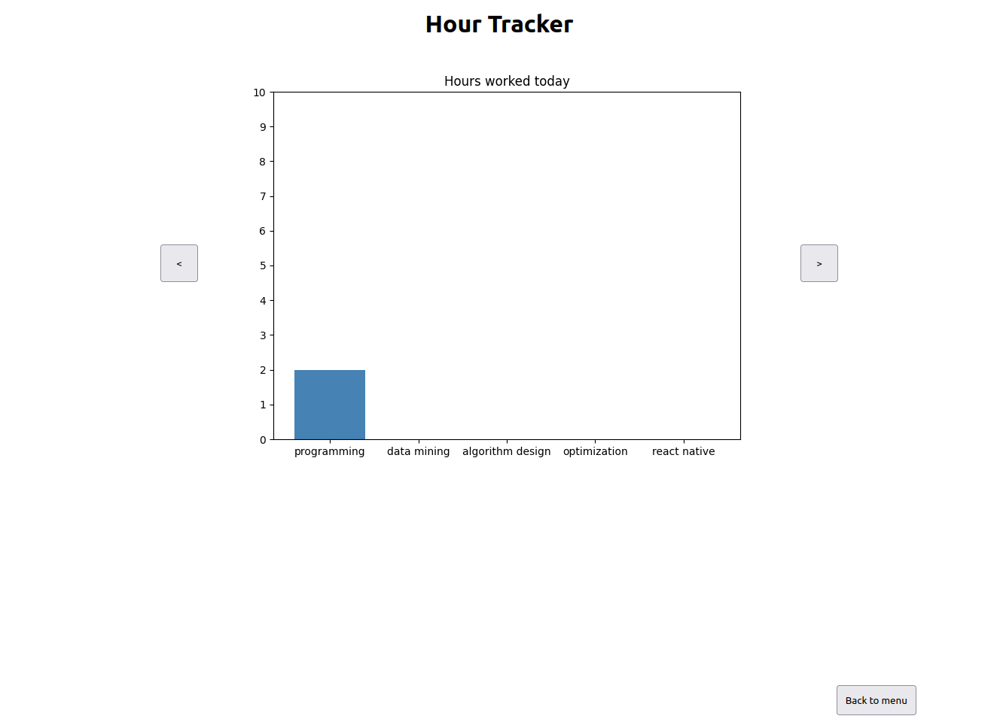

# Hour Tracker

A minimalistic web app I created using Flask. It helps me to track how much time I spent on a specific task and run statistics on the collected data.

- add new categories or pick from recently used ones

- add hours to categories and check them off once your work is done

## Statistics

- I plan on adding more statistics in the future and collect more data, e.g. at what exact time I work. Could be useful to figure out at what time I am most (and least) productive.

## Authentification

- how accounts are created will be explained in the following section 

## Installation

1. run ``python3 sign_up_user.py``
There you are asked to provide a username and a password (their hashes are stored on the server). Additionally, a secret session key is generated. Currently only one user is supported (plan on extending this in the future).

2. run ``python3 start.py`` to start the server. You can access it under `your ip`/hour_tracker/login:5000.
For the hour tracker to run all the time, check out the linux tool `screen` (especially the `detach from session` function)

3. If something goes wrong, you can shut down the server using ``Ctrl+C``. Additionally, you can clear the entire database by executing `python3 clear_database.py`(although not recommended)

